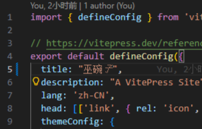

# 巫碗子简介

这是我正式搭建个人博客之前，用于尝试建站的测试性网站。

所以这**不是**那个“正式”的博客。

## 巫碗子网站的由来

一开始我准备搭个个人博客玩玩，买完域名后继续查教程，突然觉得除了买域名之外都好麻烦。

然后就不想搞了。

但是后来又想，这域名买都买了，钱都花出去了，不用白不用啊。

于是终于在一个月之后开始准备网页内容等等（纯懒）。

正式搭建网站之前总得先试一下，熟悉一下流程吧？

于是就先搭了这个网站。

## 巫碗子为何叫巫碗子

一开始我打算把个人博客叫做巫师之碗，测试站点就叫巫碗（呜哇！）。

那“子”是哪儿来的？

这个问题恐怕你得问自动补全。

## 这个网站未来会有什么

那个“正式”的博客搭建好后，这里大概会放一些无关的杂谈啥的。

大概也就是另一个个人博客。

（话说个人博客到底是啥？）
